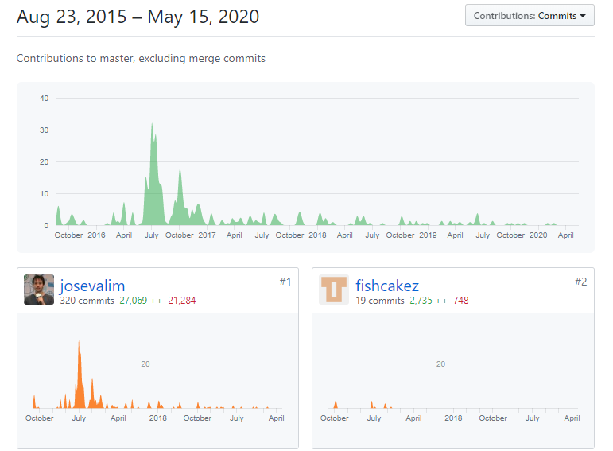

Elixir GenStage
===

GenStage to narzędzię, które pozwala na wymianę zdarzeń, danych pomiędzy procesami, z odwróconym przepływem żądań. Chodzi w skrócie o to, że proces żądą taką ilość danych jaką może swobodnie przetwożyć i taką właśnie otrzymuje.

## Cel

Jaki był właściwie powód powstania GenStage? Jose Valim chciał wprowadzić narzędzię które pozwoli na efektywne przetwarzanie danych. Jako przykład podam tu problem liczenia słów zaprezentowany na jego blogu.

```elixir
File.stream!("path")
|> Stream.flat_map(fn line ->
    String.split(line, " ")
   end)
|> Stream.async()
|> Enum.reduce(%{}, fn word, acc ->
    Map.update(acc, word, 1, & &1 + 1)
   end)
|> Enum.to_list()
```

Rozwiązanie przedstawione powyżej ma pewne wady, które występowały ogólnie podczas przetwarzania danych w ten sposób:
* Ograniczenie przesyłania danych między procesami
* Brak możliwości sprawnego uruchomienia kilku procesów przeprowadzających te same obliczenia, z innymi danymi równolegle
* Brak nadzoru nad nowymi procesami
* Nie można zapobiec wysłaniu do procesu zbyt dużej ilości danych.

Szczególnie to ostatnie może być niebezpieczne i może się przytrafić jeśli produkowanych jest więcej danych niż proces może przetwożyć. Dobrym przykładem w tym wypadku jest fabryka, w której pracownicy nie nadążają pakować wytwarzanych produktów.


## Historia

Powyższe problemy udało się rozwiązać w 2016 roku, kiedy to 14 lipca oficjalnie wypuszczono GenStage. Oprócz rozwiązania powyższych problemów miał on również zastąpić GenEvent. Od tamtego czasu GenStage jest nieustannie rozwijany, głownie przez Jose Valima.

