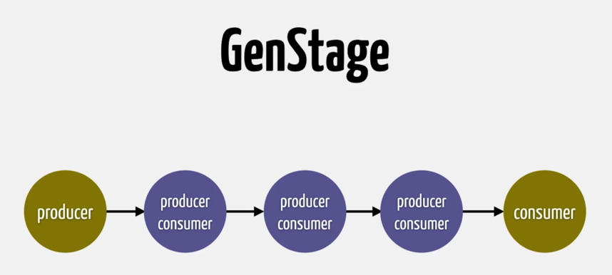
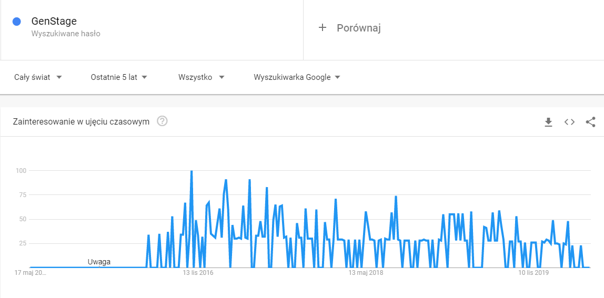

Elixir GenStage
===

GenStage to narzędzię, które pozwala na wymianę zdarzeń, danych pomiędzy procesami, z odwróconym przepływem żądań. Chodzi w skrócie o to, że proces żądą taką ilość danych jaką może swobodnie przetwożyć i taką właśnie otrzymuje.

## Cel

Jaki był właściwie powód powstania GenStage? Jose Valim chciał wprowadzić narzędzię które pozwoli na efektywne przetwarzanie danych. Jako przykład podam tu problem liczenia słów zaprezentowany na jego blogu.

```elixir
File.stream!("path")
|> Stream.flat_map(fn line ->
    String.split(line, " ")
   end)
|> Stream.async()
|> Enum.reduce(%{}, fn word, acc ->
    Map.update(acc, word, 1, & &1 + 1)
   end)
|> Enum.to_list()
```

Rozwiązanie przedstawione powyżej ma pewne wady, które występowały ogólnie podczas przetwarzania danych w ten sposób:
* Ograniczenie przesyłania danych między procesami
* Brak możliwości sprawnego uruchomienia kilku procesów przeprowadzających te same obliczenia, z innymi danymi równolegle
* Brak nadzoru nad nowymi procesami
* Nie można zapobiec wysłaniu do procesu zbyt dużej ilości danych.

Szczególnie to ostatnie może być niebezpieczne i może się przytrafić jeśli produkowanych jest więcej danych niż proces może przetwożyć. Dobrym przykładem w tym wypadku jest fabryka, w której pracownicy nie nadążają pakować wytwarzanych produktów.


## Historia

Powyższe problemy udało się rozwiązać w 2016 roku, kiedy to 14 lipca oficjalnie wypuszczono GenStage. Od tamtego czasu GenStage jest nieustannie rozwijany, głownie przez Jose Valima. Po kilku latach rozwoju, w lutym tego roku doczekaliśmy się wersji v1.0.0 Elixir GenStage. 


GenStage był wprowadzany jako narzędzię do przetwarzania danych, ale nie tylko. Jednym z celów podczas wprowadzanie GenStage było również zastąpienie GenEvent. Rozwiązywał on kilka problemów związanych z GenEvent między innymi to, że zarówno menadżer zdarzeń jak i ich obsługa działały w jednym procesie. 

## Opis działania

GenStages wyróżnia trzy etapy.
```
[A] -> [B] -> [C]
```

* A to producent który otrzymuję żadania - liczbę zdażeń, danych którą konsumenci mogą obsłużyć, oraz generuje te dane.
 * B to producent-konsument, który przekazuję żądania do A, oraz przetważa otrzymane od producenta dane i wysyła do konsumenta
 * C to konsument, który otrzymaje dane i przetważa je w zdefiniowany przez programistę sposób

 ### Producent

W producencie najważniejsze są dwie funkcje:
*  ```init/1``` która inicjalizuje stan początkowy. Zwraca dwu-elementową tuple, w której pierwszy element określa moduł jako producenta, a drugi element to stan początkowy, na przykład jakieś źródło danych przekazane w argumencie ```arg```.

* ```handle_demand/2``` odpowiada za obsługę żadania konsumenta odnosnie danych. Argument ```demand``` określa maksymalną liczbę danych jaką konsument może przetworzyć i to na jego podstawie producent generuje odpowiednią liczbę danych i uaktualnia swój stan. Zwraca tuple trzy-elementową, w której pierwszy element to atom ```:noreply```, drugi to lista danych dla konsumenta, a trzeci nowy stan producenta.

 ```elixir
  defmodule Producer do
      use GenStage

      def init(arg) do
        {:producer, :initial_state}
      end

      def handle_demand(demand, state) do
        {:noreply, [:data, :data], state}
      end
    end
 ```

### Producent-Konsument

W producencie-konsumencie musimy zwrócić uwage na:
* ```init/1``` działa dokładnie tak samo jak dla producenta tylko, musimy w pierwszym elemencie tupli zaznaczyć, że chodzi o producenta-konsumenta

* ```handle_events/3``` obsługuję dane otrzymywane od producenta i przekazuję je dalej. Również zwraca trzy-elementową tuplę, taką samą jak ```handle_demands``` w przypadku producenta.

```elixir
 defmodule ProducerConsumer do
      use GenStage

      def init(arg) do
        {:producer_consumer, :initial_state}
      end

      def handle_events(data, from, state) do
        {:noreply, data, state}
      end
    end
```

### Konsument
 W konsumencie wyrówniamy te same funkcję co w przypadku producenta-konsumenta z dwoma różnicami. W przypadku konsumenta ```handle_events/3``` musi zwracać tuplę, w której drugi element to pusta lista, natomiast w funkcji ```init/1``` musimy zaznaczyć, że chodzi o konsumenta w zwracanej przez nas tupli.

```elixir
defmodule Consumer do
      use GenStage  

      def init(arg) do
        {:consumer, :initial_state}
      end

      def handle_events(data, from, state) do
        {:noreply, [], state}
      end
    end
```

### Stosowanie

Schemat jest bardzo prosty, jednak pozwala nam tworzyć również bardziej skomplikowane projekty, w których może pracować wielu producentów i konsumentów. Ogólnie GenStage świetnie nadaje się do tworzenia:

* Potoków transformacji danych
* Kolejek
* Obsług zdarzeń



## Demo

W celu przetestowania możliwości GenStage w praktyce stworzyłem mini-projekt z użyciem Elixir GenStage.

### Opis projektu

### Implementacja

## Podsumowanie

